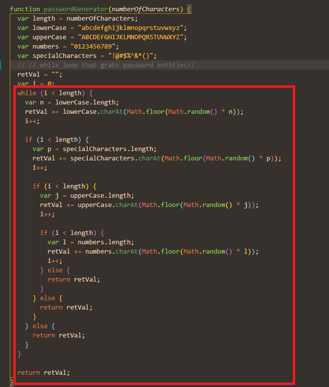

# HW3 Random Password Generator

## Description

For this project I had to create a password generator. My motivation for the project was to provide a solution to create a strong password for users. Throughout the creation of this generator I sharped my javascript skills regarding loops and if statements. I also honed in my trouble shooting skills.

## Table of Contents (Optional)

- [Creation](#creation)
- [Credits](#credits)
- [License](#license)

## Creation

In order to make this password generator work, I had to create the criteria for the password and I had to make a function that pulled the characters. I first made if and else statements that guided the user on what characters their password would have using confirm and prompts. I then recorded that input and put it in a function that pulled the correct criteria and displayed it on the screen with a return.




## Credits

- Professional ReadMe-https://coding-boot-camp.github.io/full-stack/github/professional-readme-guide
- W3 Collective-https://w3collective.com/random-password-generator-javascript/

## License

Copyright (c) [2022] [Bryson Kern]

Permission is hereby granted, free of charge, to any person obtaining a copy
of this software and associated documentation files (the "Software"), to deal
in the Software without restriction, including without limitation the rights
to use, copy, modify, merge, publish, distribute, sublicense, and/or sell
copies of the Software, and to permit persons to whom the Software is
furnished to do so, subject to the following conditions:

The above copyright notice and this permission notice shall be included in all
copies or substantial portions of the Software.

THE SOFTWARE IS PROVIDED "AS IS", WITHOUT WARRANTY OF ANY KIND, EXPRESS OR
IMPLIED, INCLUDING BUT NOT LIMITED TO THE WARRANTIES OF MERCHANTABILITY,
FITNESS FOR A PARTICULAR PURPOSE AND NONINFRINGEMENT. IN NO EVENT SHALL THE
AUTHORS OR COPYRIGHT HOLDERS BE LIABLE FOR ANY CLAIM, DAMAGES OR OTHER
LIABILITY, WHETHER IN AN ACTION OF CONTRACT, TORT OR OTHERWISE, ARISING FROM,
OUT OF OR IN CONNECTION WITH THE SOFTWARE OR THE USE OR OTHER DEALINGS IN THE
SOFTWARE.

```

```
